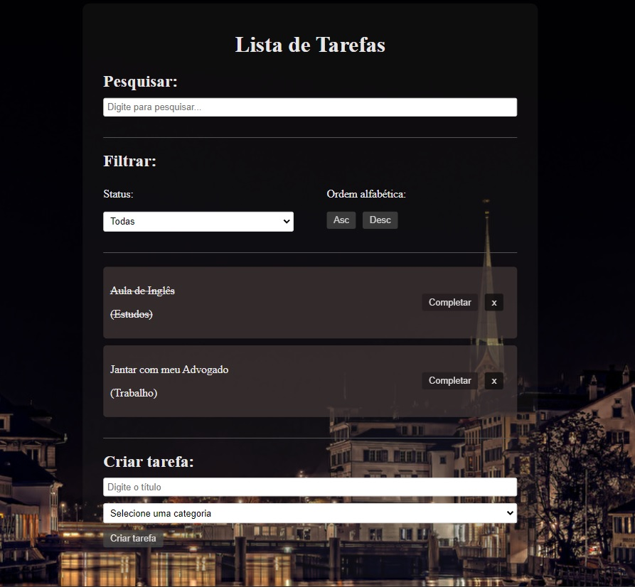

<p align="center">
    
</p>

<br>

## 💻 Project

 Lista de Tarefas is an online system dedicated to the streamlined registration and management of tasks. Its primary objective is to facilitate the tracking of daily activities by providing an intuitive platform for creating checklists and recording task completion.

## 🧪 Development

This project was developed using:

- [React](https://reactjs.org)

## 🚀 Running

To start the project, execute the following commands:


```bash
# To start the server
$ npm run dev
```

The app will be available on the browser by accessing the address http://localhost:5173.
